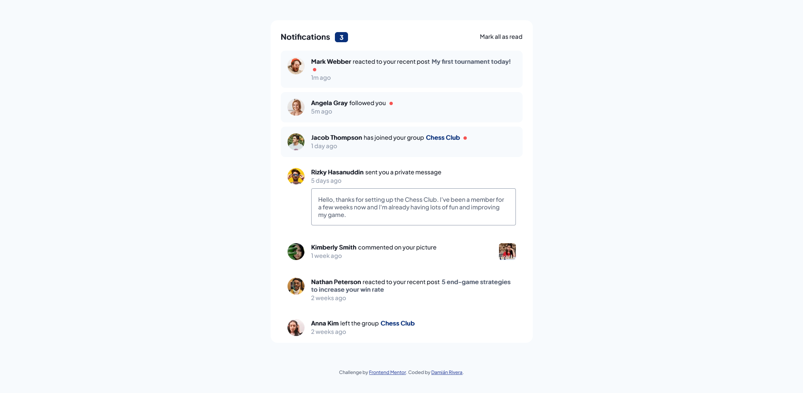

# Frontend Mentor - Notifications page solution

This is a solution to the [Notifications page challenge on Frontend Mentor](https://www.frontendmentor.io/challenges/notifications-page-DqK5QAmKbC).

## Table of contents

- [Frontend Mentor - Notifications page solution](#frontend-mentor---notifications-page-solution)
  - [Table of contents](#table-of-contents)
  - [Overview](#overview)
    - [The challenge](#the-challenge)
    - [Screenshot](#screenshot)
    - [Links](#links)
  - [My process](#my-process)
    - [Built with](#built-with)
    - [What I learned](#what-i-learned)
    - [Continued development](#continued-development)
  - [Author](#author)

## Overview

### The challenge

Users should be able to:

- Distinguish between "unread" and "read" notifications
- Select "Mark all as read" to toggle the visual state of the unread notifications and set the number of unread messages to zero
- View the optimal layout for the interface depending on their device's screen size
- See hover and focus states for all interactive elements on the page

### Screenshot

### Links

- Solution URL: [Notifications main page Code](https://github.com/DamianRi/notifications-page-main/)
- Live Site URL: [Notifications main page Live](https://damianri.github.io/notifications-page-main/)

## My process

### Built with

- [Vue](https://vuejs.org/) + [vite](https://vitejs.dev/)
- SCSS custom properties
- Flexbox
- Mobile-first workflow
- [Typescript](https://www.typescriptlang.org/)

### What I learned

I practiced how to create some components in Vue 3.
But my main problem was how to deploy my project on github pages. If you have some similar problems, you could visit this [docs](https://vitejs.dev/guide/assets.html#the-public-directory) or one solution from [stackoverflow](https://stackoverflow.com/questions/68758939/github-pages-vite-js-build-not-showing-the-images)

### Continued development

More vite configurations and more deployments with this technology

## Author

- Website - [Still working on](https://www.---.com)
- Frontend Mentor - [@DamianRi](https://www.frontendmentor.io/profile/DamianRi)
